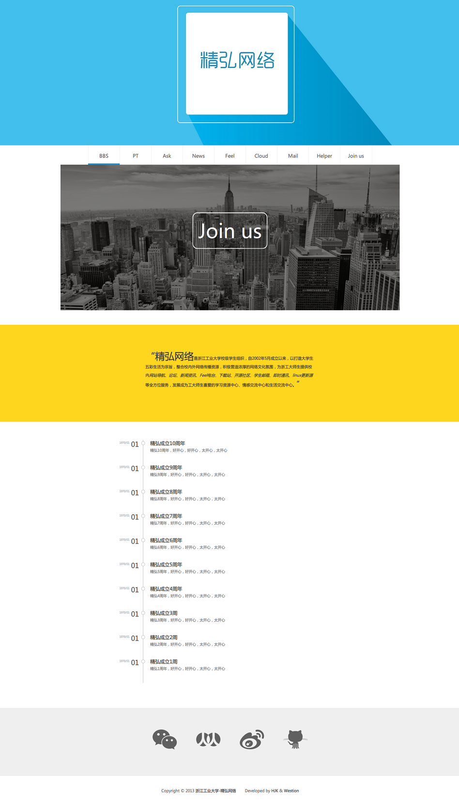

#精弘网络首页文档

###内容

发布地址：[www.zjut.com](http://www.zjut.com)

做成带时间轴的事件展示，精弘产品导航和最新的消息通知的精弘网络新首页

后台可以管理事件、导航，以及最新通知

##2014-08-20更新

###需要修改的ajax接口

- index.html

    `var host = "http://127.0.0.1:8080/jh_www/api?";`

- login.html

    `$.post("../jh_www/admin/login?APPID=APPID01&token=saf32e34ewsf8f42"`

- admin.html

    `var host = "http://127.0.0.1:8080/jh_www/api?";`

    `var adminhost = "http://127.0.0.1:8080/jh_www/admin/api?";`

##2014-08-19更新 v0.9.1

###前端部分文件结构

- index.html
- login.html
- admin.html
- js/
- css/
- img/
- banner/   首页幻灯片专用，替换原文件即可，分辨率要1300*600
- 需配合westion的后台接口使用，第一次需修改ajax接口

###后台管理方法：

- login.html为登陆页，admin.html为管理页
- 未登录时可以访问admin页面，但是无法进行操作
- 导航支持增加、删除、修改功能，排序由权重依次降低
- 新活动显示在index的图片幻灯片中，文字不得超过10个字
- 事件显示在index的时间轴中，按时间排序。时间指发生时间，时间格式必须为“YYYY-MM-DD”
- 首页幻灯片暂不支持更换，如需更换请联系技术管理员

###下一版本将更新的内容：
- 增加全局404页面
- 优化代码结构，设置admin页面访问权限
- 增加事件和通知的图片
- 通知的图片为幻灯片背景
- 首页支持显示多个通知

###联系
后台：Github:[吴子旋](github.com/westion717)

前端：GitHub:[0xHJK](github.com/0xHJK/) &nbsp; Mail: Jackin.works#gmail.com &nbsp; Blog: [HJK.im](http://www.hjk.im)

*前后端文档分离，文档见项目wiki*

###备注
github使用简约教程，参见suzie的[github多人协作][1]
[1]:https://github.com/ZJUT/hello-github/blob/master/How-to-use-Github.md

###预览

